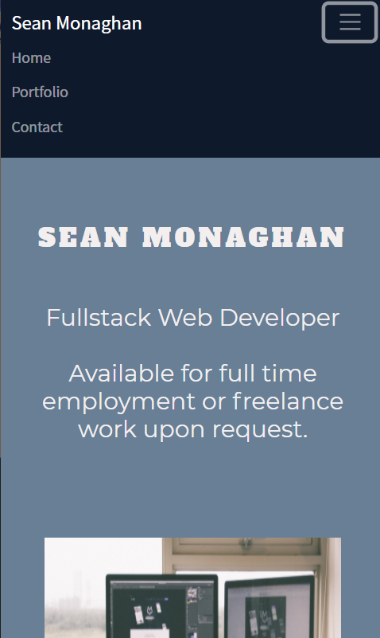
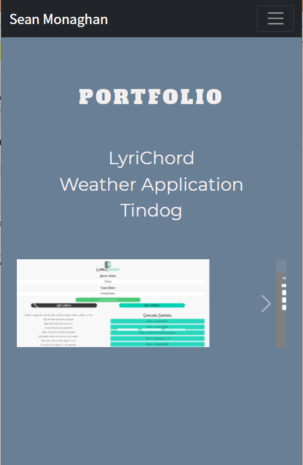
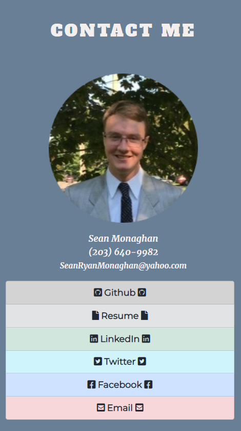

# CV

Link to CV: https://seanmonaghan.github.io/

## Bio

This is the personal CV of Sean Monaghan, an aspiring web developer with a passion for learning new coding languages and practices.  Currently I am working towards a Certificate from the University of Connecticut in Fullstack Web Development.  Previously, I have attended Connecticut College and obtained a BA in International Relations and Global Islamic Studies.  I have applied all of the soft research and liberal arts skills I have developed over my time obtaining my degrees and the work ethic I have developed over my last four years working for the United States Postal Service into learning Web Development.

I have taken a course through Southern Connecticut STate University to learn the basics of programming languages where I learned the fundamentals of Python.  I then completed an 80 hour course on Fullstack Web Development by the App Brewery on Udemy to transfer those skills I had learned into Javascript and pick up other languages essential to web development.  

I am currently engaged in a Certificate in Fullstack Web Development through the University of Connecticut where I intend to continue to pick up more essential skills and continue to hone the ones I have already learned.  In addition to this course, I am also keeping up with my studies in Python as well as planning on learning other programming languages such as Java, C# and Ruby.  

## Site Overview



```
When the user enters the site they are met with a brief description of myself and 
what I can provide for them as a prospective employee or contractor.  

All elements of this site are styled using Bootstrap, including the responsive design
that functions just as well with mobile as it does desktop.

```



```

When the user naviagtes to the Portfolio portion of the page, they are given three links
to my three most recent projects.  A display image of each is also looped through using the
bootstrap Carousel so the user can see a glimpse of what the site looks like with a brief 
description before leaving the site to see it deployed.  

```




```
For anyone interested in getting in touch or learning more about me, there is a contact page
that provides links to all of my major social media and ways to contact me.  My personal info
can be quickly found including my email address and phone number.

I am also working on getting a mailing list going, so that people interested in my work can sign
up their own email and recieve updates on what projects I am working on as well as what new
technologies I am learning. 

```
